  

  

&nbsp;

 

 

SE-2 at **Summit** (formerly Spenmo) — 4+ years shipping expense management, corporate cards, reimbursements, and invoice tooling across a distributed TypeScript · Node.js · Go stack.

Automobile engineer by degree. Co-founded a startup before going deep on engineering. In my free time I like building RAG pipelines, and running a homelab that's about to get very busy with agents.

 

 

### What I'm building

| | |
|---|---|
| 💳 **Summit** | B2B spend management — cards, budgets, reimbursements, invoicing at scale |
| 🎨 **Research** | Generative visualisation · AI-assisted creative workflows |
| 🤖 **Research** | Conversational AI · real-time communication |
| 🧠 **AI/ML** | RAG pipelines · NLP sentiment · ensemble models · working toward training custom models |
| 🖥️ **Homelab** | Proxmox · ZeroTier · agent automation incoming |

 

 

### Open source

| | Project | Stack |
|---|---|---|
| ⭐ 13 | [**boomer-rider**](https://github.com/gsbakshi/boomer-rider) — Ridesharing app | Flutter · Firebase |
| | [**NebulaTV**](https://github.com/gsbakshi/NebulaTV) — Android TV launcher & multi-tab browser | Kotlin · GeckoView · Firefox Sync |
| | [**metaface**](https://github.com/gsbakshi/metaface) — Face detection web app | React · Express · PostgreSQL · Redis |

 

 

### Stack

**Frontend & Mobile**

  

**Backend & Data**

  

**Infra, Cloud & Tooling**

  

**AI & ML**

 

 

### GitHub

  

 

  

 

  
  

 

  
  &nbsp;
  

 

  

 

